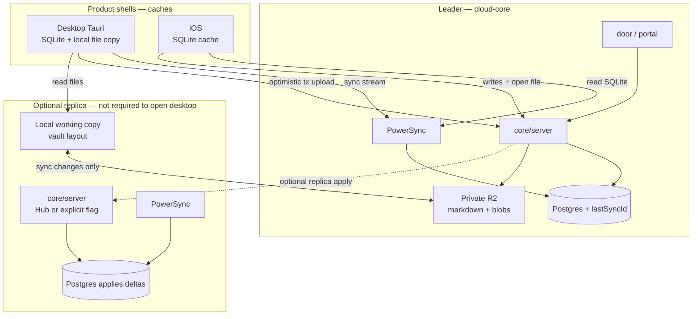

# Linear-shaped sync (target architecture)

**Status:** Target — replaces peer-twin LWW + desktop dual-hydrate as the product strategy.  
**Revokes:** Phase 6.3 “keep dual-hydrate until gates pass” ([`04-api-and-sync.md`](04-api-and-sync.md)).  
**Related:** LSE reverse-engineering ([SUMMARY](https://github.com/wzhudev/reverse-linear-sync-engine/blob/main/SUMMARY.md)), hybrid topology ([`13-hybrid-cloud-local-core.md`](13-hybrid-cloud-local-core.md)), file store ([ADR-035](10-decisions-log.md)), Docker-not-default ([`17-desktop-without-docker.md`](17-desktop-without-docker.md)), ADR tiers ([`03-data-model.md`](03-data-model.md)).

**Shell sync (2026-09-19):** Product desktop and iOS sync client SQLite to **cloud** PowerSync. The Mac compose stack is an optional replica, not the desktop sync peer. The diagram below matches that. Code still starts local Docker — see doc 17.

## Product call

| Decision | Choice |
| --- | --- |
| Leader / clock | **Cloud-core** is the elected leader for the shared workspace clock when hybrid is on. It assigns monotonic sync ids and is reachable when the Mac sleeps (door, portal, phone). |
| Desktop / iOS | **Caches**, not a second brain. Optimistic UI → queued mutations → server executes → ordered deltas. LWW is safe because the **server already ordered** writes. |
| local-core | Optional Mac **replica** (Docker compose). Not required to open desktop. Not a second writer while the product shell is a cloud client. Not something iOS depends on. See [17-desktop-without-docker.md](17-desktop-without-docker.md). |
| iOS | Client of **cloud-core** only. Not a core. PowerSync against cloud Postgres. |
| Speed | Local SQLite reads + optimistic writes + bootstrap-then-delta — **not** REST fan-out or `mergeLocalAndApiByUpdatedAt`. Desktop file reads hit the local working copy, not R2, on every open. |
| Files | **R2** is the shared store (markdown + letter PDFs + attachments + avatars + other `.backsteros` blobs). The Mac vault is the desktop working copy and syncs changes (ADR-035). `workspace_settings.vaultPath` stays denylisted from replication. |
| Tier C/D | Unchanged ADR-010: no bulk PDF / full bodies in client SQLite. |

Until cloud is fully the single total-order authority, we still harden the twin (split cursors, empty-body guards) so we do not lose rows or empty documents while migrating.

## Target diagram

## Client model (desktop)

1. **Bootstrap** Tier A/B into local SQLite (PowerSync download / sync bootstrap).
2. **Read path** = local SQLite only for list/detail metadata.
3. **Write path** = optimistic local patch → mutation queue (`mutation_id`) → `/powersync/write` → wait for server ack / delta containing that sync id. (`/sync/push` is DEAD — storage-health only.)
4. **No** `mergeLocalAndApiByUpdatedAt` for product lists. REST may remain for one-shot Tier C/D fetches and cold-start rescue **only until** PowerSync download is proven — not as a second source of truth.
5. Open markdown and blobs stay out of client SQLite (Tier C/D). **Desktop** reads them from the local working copy. **iOS** fetches the object from cloud-core / R2 when opened. PowerSync does not sync file bytes.

## Core model

1. **One write pipeline** — REST, agent, and PowerSync uploads all bump versions and append `sync_events` (or the future `lastSyncId` log) with the same shape.
2. **Mutation receipts** — idempotent `mutation_id`; duplicates ack without re-apply.
3. **Ordered deltas** — clients and local-core advance a monotonic cursor; gaps are detectable.
4. **Files** — R2 is shared authority (ADR-035). Desktop syncs a local working copy (changes only; empty-body invariant: never empty-over-nonempty). Metadata cannot LWW-win a zero body over richer bytes.
5. **Replication** — pull and push watermarks are **split** so peer tip cannot skip local rows.

## What we are deleting as strategy

| Old | New |
| --- | --- |
| Peer cores race on `updated_at` | Leader total order / sync id |
| Desktop REST + SQLite merge by wall clock | SQLite read; server-ordered write |
| Dual-hydrate “forever” | Temporary rescue only, then remove |
| `vaultPath` as shared settings | Host env denylist |

## Implementation slices (this program)

1. Core correctness unblocks: split cursors, empty-body, vaultPath denylist, REST→`sync_events`.
2. Monotonic cursor clients can wait on (extend `sync_events.cursor` → shared `lastSyncId` story).
3. Desktop: local-only Tier A/B lists; remove merge helpers; keep upload path.
4. Docs/13 rewrite to Phase B live + Linear leader; iOS follows shared packages later.

## Cutover progress (Sep 2026)

| Slice | Status |
| --- | --- |
| Split pull/push replication cursors + migration `0077` | Landed |
| Empty-body vault push/apply guards | Landed |
| `vaultPath` / machine-local settings denylist | Landed |
| REST document content → `sync_events` | Landed |
| Desktop `resolveLocalOrApiRows` local-only when SQLite has rows (no newer-API overlay) | Landed |
| Desktop cold-start-only REST hydrate (skip when `lastSyncedAt` or connected+local rows) | Landed — mobile-parity policy in `rest-list-hydration-policy.ts` |
| Ready gate ignores `restHydrateSettled` (local / api rescue / grace only) | Landed |
| API column fillers only on cold start (no live REST field merge) | Landed |
| Soft-refresh tasks/meetings/projects/documents skip while PowerSync connected | Landed |
| Documents 12s REST list soft-revalidate | Removed — SSE + PowerSync only while connected |
| Optimistic `api*` patches for Tier A/B while PowerSync ready | Removed — SQLite watches are authoritative (documents still warm `apiDocuments` for shell pending creates) |
| Documents/projects SSE → sparse `live*ById` overlay (`applyLiveEntityOverlay`) | Landed — not full REST list merge |
| Task status REST confirm while connected | Removed — await PowerSync flush; REST only if flush empty/failed |
| Pending API creates merge (`mergeLocalWithPendingApiCreates`) | Partial — keep until watch latency for shell creates is proven |
| Documents `mergeLocalDocumentsWithLiveApi` full-list path | Deprecated adapter — prefer `applyLiveEntityOverlay` |
| Scope-move / letter-relocate / `agentInboxApproved` REST exceptions | Partial — still required |
| True cloud `lastSyncId` + replica apply protocol | Partial — local REST/PowerSync forward to `POST /internal/core-replication/mutations`; cloud assigns sync_id; local applies ordered events (no local append). Table LWW remains catch-up |
| Drop REST list hydrate entirely | Partial — desktop + mobile skip while connected + SQLite has rows; empty-SQLite / offline rescue remains |
| Mobile inbox/tasks force-hydrate + live due-date REST merge | Removed — real `hasLocalRows`; no REST field merge while connected with local rows |
| Mutation receipts across cores | Partial — REST/PowerSync claim receipts; leader accept is idempotent on event mutation id |
| Desktop writes via PowerSync upload only | Partial — `shouldSkipRestEntityWrite`; remaining REST: scope move (number), letter vault relocate, `taskPatchRequiresRestWrite` (`agentInboxApproved`), flush-empty fallback |
| Legacy `/api/v1/sync/{bootstrap,pull,push}` | Quarantined DEAD — storage-health only; do not build new clients |
| Leader-first writes (cloud clock) | Partial — local-core forwards when `CORE_REPLICATION_ROLE=local`; offline falls back to local clock |

## Desktop acceptance gates (connected + SQLite has rows)

Do **not** add new `fillMissing*FromApi` live overlays or newer-API list merges. Ship only when:

1. Task status / Communication notification icon / due date never flash REST→local.
2. Product lists do not change when `/api/v1/tasks` (or sibling list GETs) are slow or stale.
3. Cold start with `lastSyncedAt` set never fans out wave 1/2 REST hydrate.
4. Empty SQLite + no sync still shows cold-start rescue **or** an explicit empty state (no hung spinner forever). Grace period in code is **5s** (`queriesGracePeriodExpired`).

## Freeze rule

New Tier A/B columns must land in PowerSync schema + `deploy/powersync/sync-config.yaml` **before** UI depends on them. Do not paper over lag with live REST fillers.

## Non-goals

- CRDT / Yjs for markdown (ADR-013).
- Bulk Tier D into client SQLite.
- Sharing visual UI between mobile and desktop.
- Pointing replication peer URL at the public door host.
