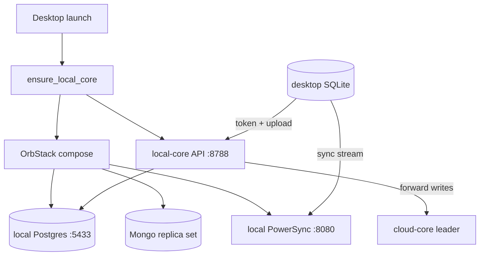
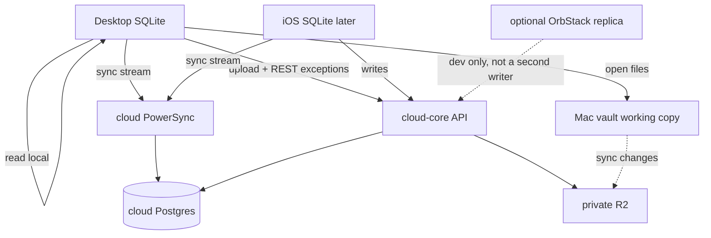

# Desktop without Docker-as-default

**Status:** Desktop does not need Docker for normal use (2026-09-19). Slice 1: lists and edits via cloud PowerSync, launch does not start Docker. Slice 2: vault path is stored on this Mac (not fetched from local-core or cloud `vaultPath`). Markdown and PDFs open from that working copy or from cloud storage. Email and agent-presence streams follow the product API; if they fail they show disconnected and do not block task or project lists. **iOS / Expo cutover is deferred and out of scope.** Compose files stay. Hub or `BACKSTEROS_START_LOCAL_REPLICA=1` can still start the optional replica. That replica must not be a second writer.  
**Amends:** [ADR-035](10-decisions-log.md) addendum — does not replace it.  
**Related:** [16-linear-shaped-sync.md](16-linear-shaped-sync.md), [13-hybrid-cloud-local-core.md](13-hybrid-cloud-local-core.md), [12-v2-local-computer.md](12-v2-local-computer.md).

## Why

Opening BacksterOS on the Mac used to start an OrbStack/Docker VM (Postgres + PowerSync + Mongo) plus the local-core API on `:8788`. That VM is about 2GB. On a 16GB M1 that also runs agents, it is the wrong default. Slice 1 stops the product app from doing that.

Linear-style local-first does not mean “run the server on the laptop.” It means the UI reads a local database immediately, queues writes, and syncs in the background. Desktop already has that local database: the PowerSync **client** SQLite (`bos-local-….db`). Slice 1 points that client at cloud PowerSync, so the sync target stays up when OrbStack is quit.

Cloud-core is already the write leader. Agents already use `https://agent.backsteros.com`. The move is to point the product shell at cloud PowerSync, and keep the compose stack as an optional replica. It is not a rewrite, and it is not “install Postgres with Homebrew.” PowerSync’s service is the hard part; a local Postgres without it does not make the app open.

## What used to start (pre-slice-1)

Product launch no longer does steps 1–2 or 5–6. Hub can still start the replica. The list is the boot graph slice 1 replaced.

1. Tauri setup calls `local_core::spawn_ensure_local_core()` ([desktop/src-tauri/src/lib.rs](../desktop/src-tauri/src/lib.rs)).
2. If `http://127.0.0.1:8788/health` fails, [desktop/src-tauri/src/local_core.rs](../desktop/src-tauri/src/local_core.rs) opens Docker.app and runs `docker compose up -d postgres mongo powersync`, then `pnpm --filter @backsteros/server dev`. Quit does not stop the stack.
3. Hub can start and stop the same containers, plus PTY (`:3101`) and Expo ([hub/README.md](../hub/README.md)). Product desktop does not start PTY or Metro.
4. Local-core cannot serve without that compose file. `DATABASE_URL` is Postgres on `:5433`. Compose is Postgres 17 (`wal_level=logical`), Mongo 7 as a single-node replica set, and `journeyapps/powersync-service` on `:8080`. Mongo exists because PowerSync bucket storage needs transactions. That is the weight, not “a database.”
5. The UI already reads lists from SQLite ([desktop/src/lib/powersync.ts](../desktop/src/lib/powersync.ts)). Uploads go to `POST /api/v1/powersync/write` on `VITE_API_URL`, which defaults to `http://127.0.0.1:8788` ([desktop/src/lib/env.ts](../desktop/src/lib/env.ts)). Auth is the `local` shell token.
6. [core/server/src/lib/powersync-auth.ts](../core/server/src/lib/powersync-auth.ts) rewrites the sync URL to `http://127.0.0.1:8080` for any Tauri or localhost origin, even when `POWERSYNC_URL` is a Tailscale host.
7. When `CORE_REPLICATION_ROLE=local`, local-core forwards writes to cloud-core. Cloud PowerSync runs on the VPS behind the `powersync` profile ([deploy/cloud/docker-compose.yml](../deploy/cloud/docker-compose.yml)). It is healthy on the tailnet. Desktop and iOS are not pointed at it yet ([deploy/cloud/README.md](../deploy/cloud/README.md)).

## Target

Same model as ADR-035 and [16-linear-shaped-sync.md](16-linear-shaped-sync.md), with one change: the desktop PowerSync peer is **cloud** PowerSync, not the Docker service.

- Instant UI from SQLite. Offline means the queue waits. Cloud assigns order when the upload lands.
- One PowerSync service, next to cloud Postgres, for desktop and (later) iOS. The two clients do not sync with each other.
- `docker-compose.yml` stays in the repo. Hub or an explicit flag starts it. The product app does not.
- Files stay as ADR-035: private R2 is the shared store; the Mac vault is the working copy. Tier C/D bytes stay out of SQLite.
- Agents stay on the door. PTY stays on the Mac and is not required to open desktop.

## Gaps left after slice 2

- Launch does not start Docker. Replica start is Hub or `BACKSTEROS_START_LOCAL_REPLICA=1`.
- Owner auth is the existing `sk_live_…`. Cloud-core rejects `Bearer local`.
- Cloud-core returns the tailnet sync URL. Local-core still rewrites to loopback.
- Letter PDF bytes on this cloud are served when R2 is configured. `pdf_requires_local_core` remains only if cloud has no R2. `GET /api/v1/agent-pty/connection` is still `503` `agent_pty_unavailable`. The Mac vault path is local-only; it is not learned from sync.
- Scope move display numbers and letter PDF renames stay on the PowerSync upload. They do not call local-core. A later cloud rename that does not dual-write the row is still open.
- PTY stays on the Mac. iOS is deferred.

## Risks

- **Offline.** SQLite stays readable. Uploads stay queued. There is no local Postgres to accept product writes while cloud is down. “Offline falls back to local clock” is the replica path, not the product path.
- **Files / vault.** The working-copy path is on this Mac. Bodies are not bulk-synced into SQLite. Cloud storage still serves a file when R2 has it. PTY is still Mac-only (`503`).
- **Multi-device.** Desktop and iOS on one cloud PowerSync is the point. A running local replica must not be a second writer.
- **Agents / Tailscale.** Agents already hit the door. `tailscale serve` on `:8788` exists so cloud can nudge the replica. With the replica off, that peer URL fails, and that is acceptable. PTY and Expo stay Hub-owned.

## Phases

Do not delete `docker-compose.yml` in slice 1.

| Slice | Outcome |
| --- | --- |
| **1 — first** | Desktop Tier A/B works with OrbStack quit. Cloud PowerSync is up. Product desktop does not call `ensure_docker`. Owner credential, not `Bearer local`. |
| **2** | Done. Open markdown / blobs from the Mac working copy or cloud storage without local-core. Cold start prompts once for a vault folder and does not start Docker. `vaultPath` stays denylisted from replication. |
| **3** | **Deferred / out of scope.** iOS cutover is not part of this desktop work. Expo will be rebuilt later. |
| **4** | Compose remains the optional replica. Hub (or `BACKSTEROS_START_LOCAL_REPLICA=1`) is the only starter. It must not write while the product desktop is a cloud client. |

### Slice 1 acceptance

Quit OrbStack. Open desktop. Task and project lists render from SQLite. One edit uploads to cloud and returns on the sync stream. Compose files are still in the repo.

### Desktop needs no Docker

Normal use: OrbStack quit, nothing required on `127.0.0.1:8788` or `:8080`, cloud-core and cloud PowerSync up.

- Task and project lists still render from client SQLite.
- A markdown file and a letter PDF open from the Mac working copy or cloud storage, with no local-core request.
- No cached vault path: one prompt, no Docker, no local-core process.
- Email or agent-presence stream down: those lines say disconnected. Lists still work.
- Product launch does not run `docker compose` or open Docker.app unless `BACKSTEROS_START_LOCAL_REPLICA=1`.

## Follow-up implementation tasks

### Enable cloud PowerSync for product clients

Done (2026-09-19). The `powersync` profile is up beside cloud Postgres. Ops bind stays `http://100.75.45.22:8080` / `http://100.75.45.22:8788`. The product desktop does not use those cleartext URLs: `VITE_API_URL` and the code fallback are `https://api.local.backsteros.com`, and the client rewrites the token's cleartext sync endpoint to `https://sync.local.backsteros.com` (including `tauri dev` on `http://localhost:1420`). iOS is deferred.

### Desktop owner credential against cloud-core

Done in slice 1. Product desktop loads `sk_live_…` from `~/.config/backsteros/cli.env` (`owner_api_key`) or `VITE_OWNER_API_KEY`. It never sends `Bearer local`. The `local` token stays for the optional replica only.

### Return the cloud sync URL for a Tauri cloud client

Done in slice 1. When `CORE_REPLICATION_ROLE=cloud`, `getPowerSyncUrl` returns `POWERSYNC_URL` and does not rewrite Tauri or localhost to loopback. Local-core still returns `http://127.0.0.1:8080`. Live check: `GET /api/v1/powersync/token` with `Origin: http://localhost:1420` returned endpoint `http://100.75.45.22:8080` and CORS `access-control-allow-origin: http://localhost:1420`.

### Do not start Docker when the product desktop opens

Done in slice 1. `spawn_ensure_local_core` returns immediately unless `BACKSTEROS_START_LOCAL_REPLICA` is `1`, `true`, or `yes`. Hub still starts and stops the replica.

### Slice 1 acceptance: lists and one edit with OrbStack quit

Done (2026-09-19). OrbStack quit; `127.0.0.1:8080` refused connections; cloud `/health` and PowerSync liveness stayed 200. Desktop client SQLite (Vite on `:1420`, same PowerSync client the Tauri shell uses) showed 780 tasks and 242 projects after sync. A local title edit uploaded to cloud and a revert flush (lag 0s) cleared the marker in that SQLite. Letter `GET /api/v1/letters/:id/pdf` and letter attachment GET were `200` `application/pdf`, not `503`. Agent PTY connection was `503` `agent_pty_unavailable`.

### Fail closed on local-only REST writes

Done for the product API host. When the desktop API is not loopback, scope move, letter file rename, agent-inbox approval, and the flush-empty REST fallback do not call local-core and do not start Docker. The local SQLite patch still uploads through PowerSync. The shell says once when a scope move or letter rename skipped the disk rename. Cloud equivalents were not dual-written (that would race the upload).

### Degrade SSE when local-core is down

Done for desktop. Email and agent-presence streams use the product API (cloud-core), not `127.0.0.1:8788`. A failed connect sets those surfaces to disconnected in the shell banner. Task and project lists stay on PowerSync and do not wait on the sockets. They do not start Docker.

### Open the vault without a local API

Done in slice 2. The Mac path is `backsteros:desktop-vault-root-v1` or `VITE_BACKSTEROS_VAULT_PATH`. Settings → Storage saves that path locally when the API is cloud-core (no `PATCH` of `vaultPath`, which cloud rejects). `getDesktopVaultRoot` does not call local-core and does not adopt cloud-core's server path. Missing path: one prompt, then a clear empty state. File bodies stay out of the sync SQLite (session LRU only). `vaultPath` remains denylisted in replication.

### iOS cutover to cloud PowerSync

Deferred. Out of scope for this desktop work. Do not point Expo as part of slices 1–2.

### Keep the replica optional and single-writer

Leave `docker-compose.yml` and Hub’s Desktop toggle. Document the flag that starts the replica, and refuse product writes on local-core while desktop is in cloud-client mode. Two writers (replica clock and cloud clock) are the fork this design exists to avoid.
